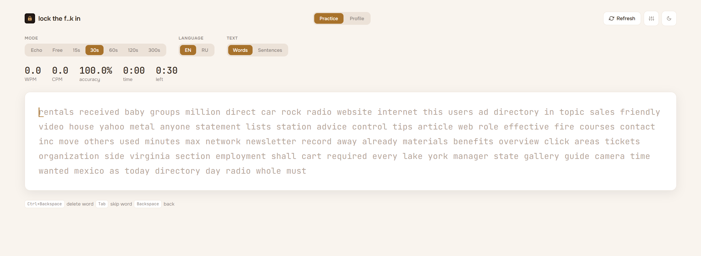
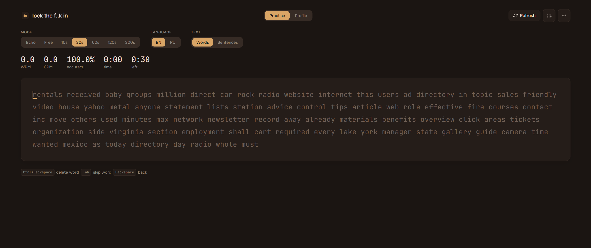
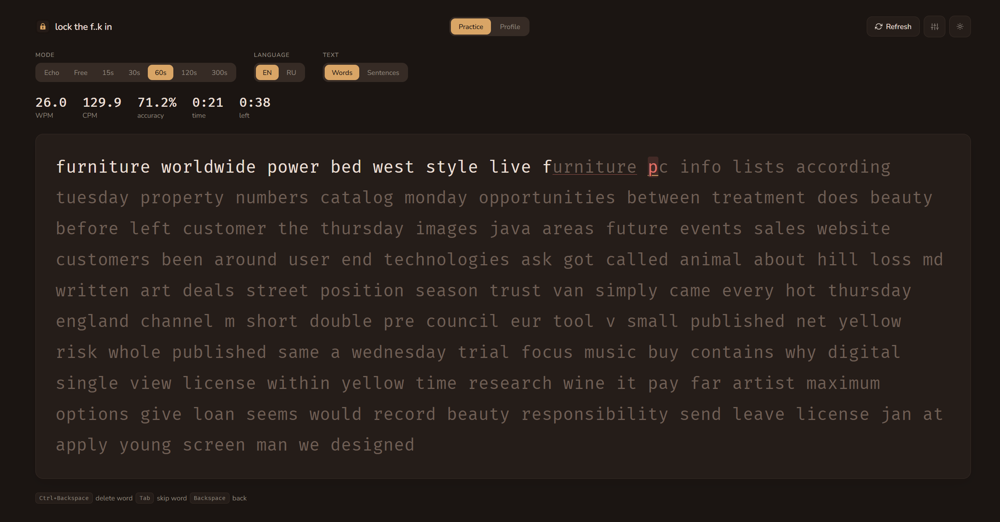
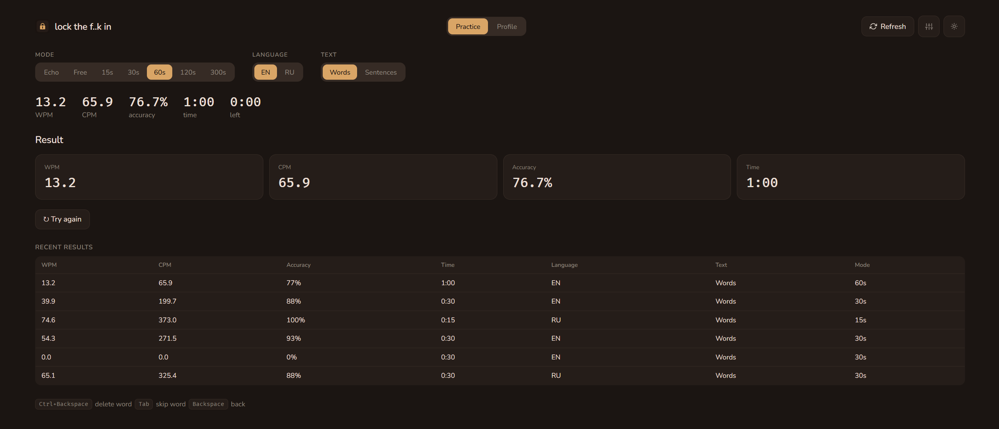
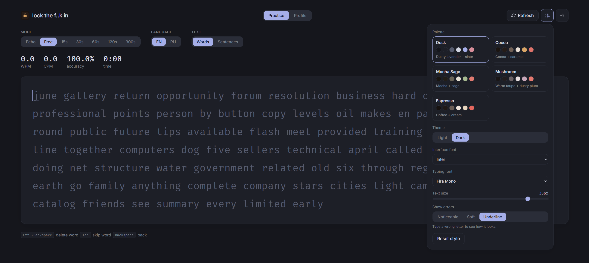
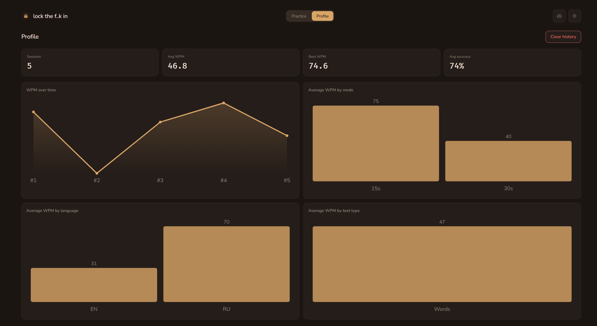
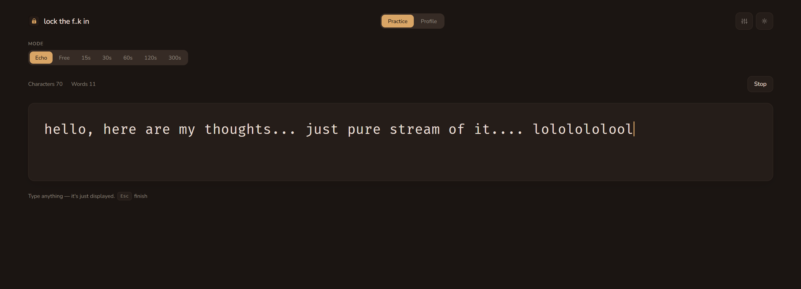

# lock in

A calm, cross-platform typing trainer — an app with a focus on typing without visual noise.

> **Current version:** 0.2.0 · [Changelog](CHANGELOG.md) · [GitHub](https://github.com/yofujitsu/lock-in)

## Screenshots

| | |
|---|---|
|  |  |
|  |  |
|  |  |



## Features

- **Per-character tracking** — correct characters advance the caret, mistakes are marked and wait to be fixed, `Backspace` goes back.
- **Live metrics** — WPM, CPM/TPM, accuracy, and speed.
- **Dictionaries** — English and Russian public word lists plus sentence sets.
- **Modes** — echo (free typing), free, and timed (15 / 30 / 60 / 120 / 300 s).
- **Shortcuts** — `Ctrl+Backspace` deletes the word, `Tab` skips it.
- **Session history** — stored locally, with a Profile page and charts.
- **Theming** — 5 palettes × light/dark, UI and typing fonts, adjustable text size, error display modes, all in a style panel.
- **Light / dark theme** with system-preference support.

## Tech stack

- **Frontend:** React 18, TypeScript, Vite, CSS custom properties (design tokens).
- **Desktop:** Tauri 2 (Rust shell for the window and bundling).
- **Tests:** Vitest.

## Project structure

```
src/
  components/     # TypingArea, TypingTest, EchoMode, Results, Profile, StylePanel, ChangelogModal, charts/
  hooks/          # useTypingSession, useStyle
  lib/            # pure core + tests: engine, metrics, session, dictionary, history,
                  # echo, wordops, text, format, stats, style, changelog
  data/           # word lists (words-en.json / words-ru.json)
src-tauri/        # Tauri 2 shell
scripts/          # fetch-dictionaries.mjs, generate-icon.mjs
```

## Getting started

### Prerequisites

- Node.js ≥ 18 and [pnpm](https://pnpm.io).
- For the desktop build: [Rust](https://rustup.rs), and on Windows the **MSVC C++ Build Tools** (`link.exe`).

### Development

```bash
pnpm install
pnpm dev        # frontend (Vite)
pnpm test       # unit tests
pnpm typecheck  # type check
pnpm build      # frontend build
```

### Desktop

```bash
pnpm tauri dev     # run in dev mode
pnpm tauri build   # production build (NSIS .exe installer on Windows)
```

On Windows the Rust build requires MSVC C++ Build Tools:

```powershell
winget install Microsoft.VisualStudio.2022.BuildTools
```

## Metrics

| Metric | Formula |
|---|---|
| WPM | (correct characters / 5) / minutes — 1 word = 5 characters |
| CPM / speed | correct characters / minutes |
| TPM | all keystrokes (correct + wrong) / minutes |
| Accuracy | correct / (correct + wrong), 0..1 |

The timer starts on the first keystroke (the Monkeytype convention).

## Dictionaries (yet being updated)

- **EN** — [google-10000-english](https://github.com/first20hours/google-10000-english) (top 1500).
- **RU** — [FrequencyWords](https://github.com/hermitdave/FrequencyWords) / OpenSubtitles2018 (top 1500).

Word lists live in `src/data/*.json`; regenerate with `node scripts/fetch-dictionaries.mjs`. See `src/data/README.md` for sources and licenses.

## Theming

The whole UI is driven by design tokens (`--bg`, `--card`, `--line`, `--typed`, `--accent`, `--err`, fonts, and text size). Now 5 palettes are bundled — **Dusk**, **Cocoa**, **Mocha Sage**, **Mushroom**, and **Espresso** — each with light and dark themes. And planning adding more. The style panel also lets you pick UI/typing fonts, adjust the typing text size, and switch error styles.

## Releasing

1. Bump the version in `package.json`, `src-tauri/tauri.conf.json`, and `src/lib/changelog.ts`.
2. Add a new entry to `CHANGELOG.md` (Keep a Changelog).
3. Commit and tag: `git tag v0.2.0 && git push --tags`.
4. Build: `pnpm tauri build` — the installer lands in `src-tauri/target/release/bundle/`.

## License

[MIT](LICENSE)
